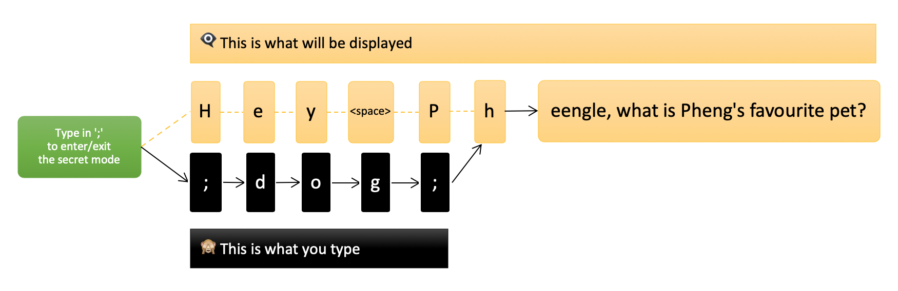
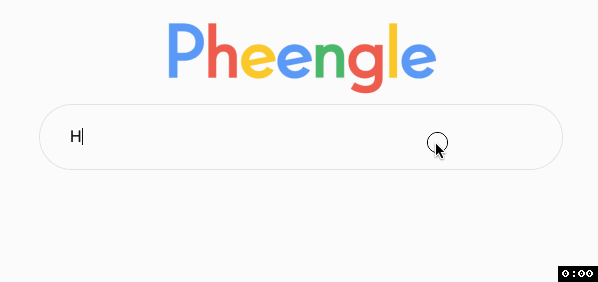
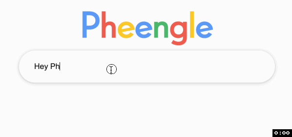
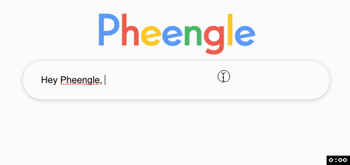

# Pheengle Search
## Overview
Use Pheengle to trick your friends into thinking the search engine knows everything about you and them. Pheengle 'claims' to know everything that is only known by you and your friends. Ask by starting with the phrase "Hey Pheengle" and follow up with the question. Submit by pressing `?`. A thinking bubble will appear with the answer shortly after.

## Secret
Instead of typing the phrase exactly as "Hey Pheengle", type in the key `;` to enter the secret mode. The victim will see 'H' as if you typed it. Type in your answer and press ; again to exit the secret mode. Complete your question as normal.

### Made a mistake?
If you had a typo, press `.` to clear the secret answer. This will exit the secret mode too. You may need to type from the beginning again. If all else fail, make some excuse and reload the page ¯\\_(ツ)_/¯.

For very long answers, the phrase can stretch and give the victim another excuse to distract them.

### Fool proof
When a victim want to try this, let them type the question as normal and the engine will give a sassy response.

> Hosted on Github Pages 👉🏽 https://aleang.github.io/Pheengle/
